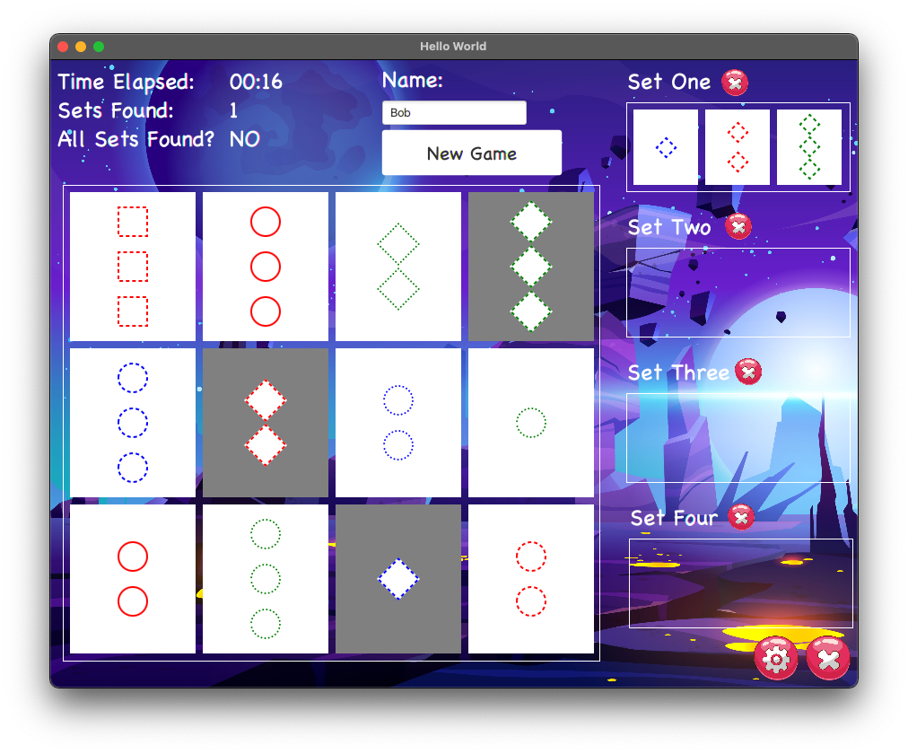
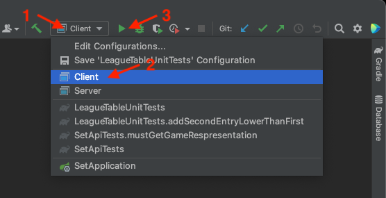

# RESTful Set Game

The aim was to develop a working implementation of the [Set game](https://www.setgame.com/set/puzzle_rules), a logic puzzle. The system comprises a server back end that provides a RESTful API and a front end that allows users to play the game.

### IntelliJ Running Instructions
 Add the following arguments to the VM options of your IDE to run the client side of the game:

 `--module-path /path/to/project/set/javafx-sdk-15.0.1/lib/ --add-modules javafx.controls,javafx.media,javafx.fxml`

**Make sure to replace the  `/path/to/project/` with the actual path on your local computer.**

Select and run Server configuration:

Select and run Client configuration:

### Non-Standard Dependencies
- [JavaFX](https://openjfx.io/): An open source, next generation client application platform for desktop, mobile and embedded systems built on Java
- [AnimateFX](https://github.com/Typhon0/AnimateFX): A library of ready-to-use animations for JavaFX

Shared with the kind permission of collaborators AT and RK.